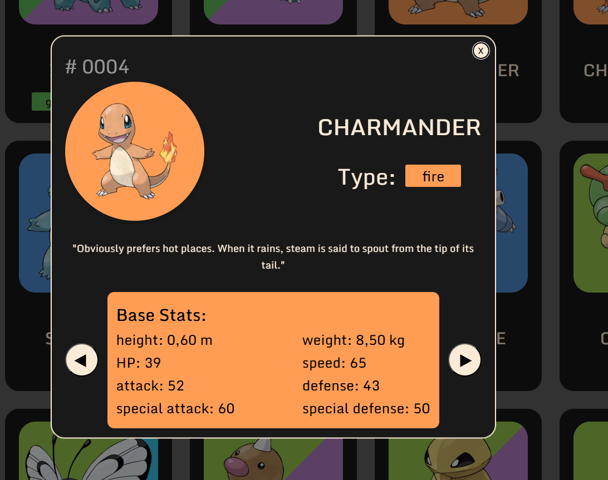

# Pokedex 🔴

A Pokédex web app built with vanilla JavaScript that fetches live data
from the [PokéAPI](https://pokeapi.co/). Browse Pokémon, view their stats,
types, and details.

🔗 **Live Demo:** [[your-link.de](https://pokedex.jonas-hildebrand.de/)](#)

## Features
- 🔍 Browse & search Pokémon
- 📊 Detailed view with stats, types and abilities
- ♾️ Load more Pokémon on demand
- 📱 Responsive design

## Tech Stack

## What I learned
- Fetching & handling data from a REST API (`fetch`, async/await)
- Rendering dynamic content with the DOM
- Structuring a vanilla JS project without frameworks

## Run locally
\`\`\`bash
git clone https://github.com/<user>/pokedex.git
cd pokedex
\`\`\`
Then open `index.html` in your browser (or use a Live Server extension).
